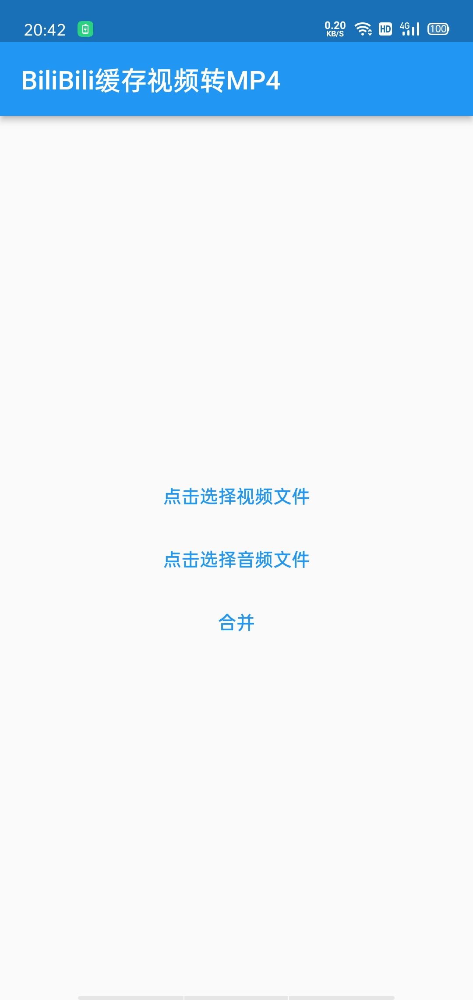
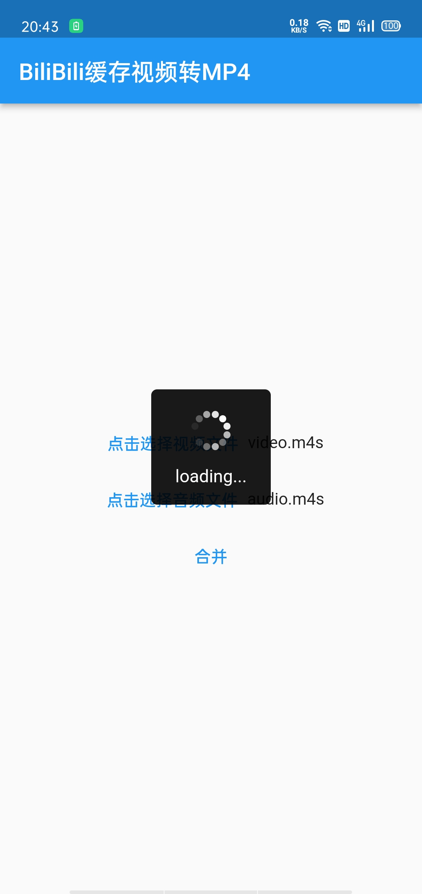
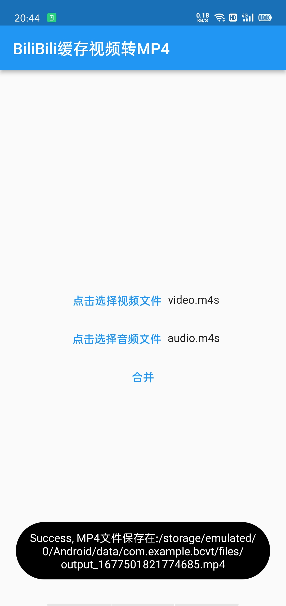

# B站缓存视频转MP4

## 项目介绍

> 由于用手机APP缓存的B站视频是音视频分离的`m4s`格式，不能够直接播放，该项目将缓存视频转换成能直接播放的MP4格式

本项目使用flutter开发，借助`ffmpeg_kit`完成视频的转换

项目依赖如下：

```yaml
dependencies:
  flutter:
    sdk: flutter
  file_picker: ^5.2.5
  fluttertoast: ^8.2.1
  path_provider: ^2.0.13
  flutter_easyloading: ^3.0.5
  ffmpeg_kit_flutter_full_gpl: 4.5.1-LTS
```


<table>
    <tr>
        <td>
            
        </td>
        <td>
            
        </td>
        <td>
            
        </td>
    </tr>
</table>


## 使用说明

1、下载并安装[APP](https://github.com/ten1fs/bcvt/releases/tag/v1.1)

2、选择要合并的视频和音频

3、点击合并按钮，等待程序执行完成

> 你也可以在电脑端用浏览器（推荐使用Chrome）访问[https://resonant-sfogliatella-f2e046.netlify.app](https://resonant-sfogliatella-f2e046.netlify.app)，上传音视频后完成转换。

## 参考资料

[https://github.com/1iuyuhe/b_cache_video_merge](https://github.com/1iuyuhe/b_cache_video_merge)

